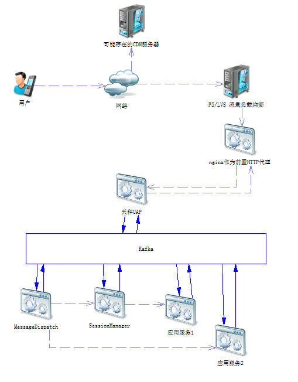
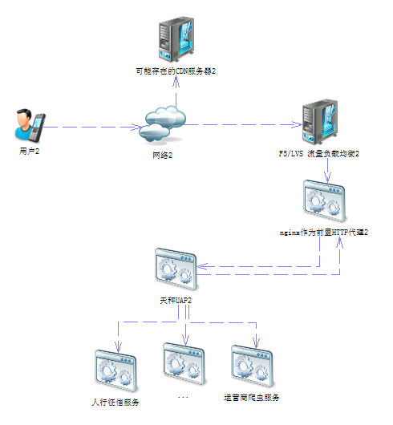
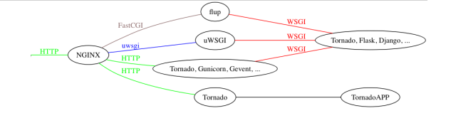
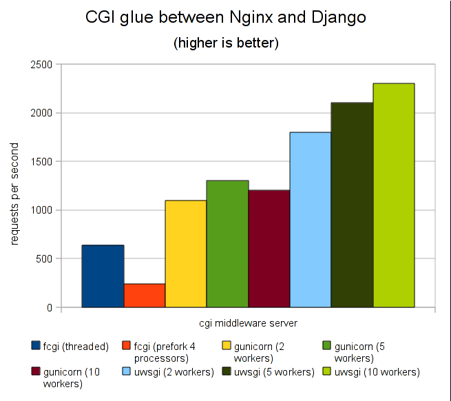
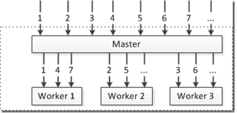
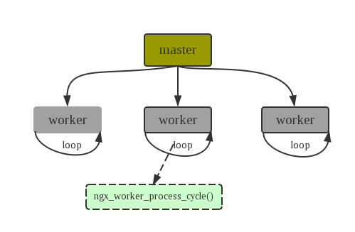
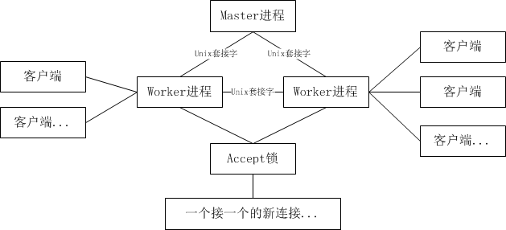

## 一、 背景

我们项目组原来使用数据总线的微服务架构，历经RabitMQ和Kafaka, 现领导已将整个系统架构用dubbo替换。
由于dubbo只支持Java开发服务端应用，故需改造Python程序以对外提供HTTP服务。
为此，我们需要研究Python的Http服务框架并为项目选择一个合适的架构。

## 二、当前QDP组的系统架构

- UAP

作为天秤的统一接入服务，其功能类似 L7 网关。将收到的http请求转为Kafka消息再派给各个子系统。
- MessageDispatch

QDP的接入程序，处于所有QDP应用程序的最前端。主要功能是：收到UAP的json请求，将其中的功能号转换成对应的MQ主题，再派给应用服务
- SessionManager

由于Python之GIL锁的存在，需开启多进程来使用多核CPU。此服务从请求报文中读取用户唯一ID，将消息均匀分发给下一级服务，同时保证同一个用户的请求总是派发给同一个进程。
- 应用服务1 
- 应用服务2 


## 三、改造后的QDP组架构


- UAP通过HTTP直接调用QDP提供的各种服务
- UAP具有鉴权/BOSS计费等各种功能，不可跳过UAP直接调用量化组的HTTP服务

## 四、Python的Http框架选择
- Django
- Tornado
- Flask
- Webpy
- bottle

比较而言， Django的功能齐但较为笨重适合于ERP/电商之类的项目；
Tornado性能好但使用起来复杂，其它框架使用gevent协程也能达到类似的异步效果;
Flask/Webpy/bottle都比较简单，而人气度最高的是Flask

综合以上原因，我认为选择Flask较为合适。


## 五、应用程序的逻辑结构


<center>图5.1 http访问流程图(摘自附录1)</center>

#### 1. 准备工作
- 测试代码
```python
#wsgi.py
import sys
from flask import Flask

app = Flask(__name__)

@app.route('/')
def index():
    return "<span style='color:red'>I am app 1</span>"

@app.route('/uwsgi/')
def index1():
    return "<span style='color:blue'>I am app 2</span>"

port = 8080
if len(sys.argv) > 1:
    port = int(sys.argv[1])

if __name__ == '__main__':
    app.run(host='0.0.0.0', port=port)
```

- 测试工具
使用wrk作为测试工具，使用示例：
```shell
./wrk -c100 -t2 -d60s   http://192.168.18.41:8080/uwsgi/
```

#### 2. nginx反向代理
nginx作为反向代理，将收到的http请求以http方式转发给后端服务。

1). 单进程模式

由于单进程只能用一个核，故直接PASS此种场景

2). Nginx反向代理 + 多进程模式

nginx作为反向代理, 后台启动多个进程，每个进程监听一个端口

nginx的配置：
```shell
upstream  backend {
    server 127.0.0.1:8081;
    server 127.0.0.1:8082;
}

server {
    location / {
        proxy_pass http://backend/;
    }
}
```

启动2个服务：
```shell
python wsgi.py 8081
python wsgi.py 8082
```

测试结果:
```shell
[root@localhost wrk-master]# ./wrk -c500 -t2 -d60s   http://192.168.18.41/uwsgi/
Running 1m test @ http://192.168.18.41/uwsgi/
  2 threads and 500 connections
  Thread Stats   Avg      Stdev     Max   +/- Stdev
    Latency   129.03ms  186.70ms   2.00s    93.42%
    Req/Sec   332.66    291.75     1.55k    77.23%
  30863 requests in 1.00m, 7.13MB read
  Socket errors: connect 0, read 0, write 0, timeout 1108
  Non-2xx or 3xx responses: 321
Requests/sec:    513.86
Transfer/sec:    121.50KB

[root@localhost wrk-master]# ./wrk -c500 -t2 -d60s   http://192.168.18.41/uwsgi/
Running 1m test @ http://192.168.18.41/uwsgi/
  2 threads and 500 connections
  Thread Stats   Avg      Stdev     Max   +/- Stdev
    Latency   250.85ms  203.98ms   2.00s    87.73%
    Req/Sec    65.69    136.01   730.00     88.10%
  2993 requests in 1.00m, 1.64MB read
  Socket errors: connect 0, read 0, write 0, timeout 971
  Non-2xx or 3xx responses: 301
Requests/sec:     49.81
Transfer/sec:     27.87KB
```
单独使用nginx + flask, 并发量大时就频繁出现“error: [Errno 32] Broken pipe”, 很不稳定。

#### 3. nginx + uwsgi

上面的例子，nginx作为反向代理，通过HTTP请求flask服务。但nginx跟后端交互，还有cgi/fastcgi/WSGI/等方式，为什么选择uwsgi? 这是从网站上找的一个基准测试图：



<center>图5.2 各种框架的benchmark(摘自附录2) </center>

该图显示uwsgi性能最优。
现在将nginx配置通成通过uwsgi请求flask服务。

##### 1). nginx + 多个uwsgi + 每个uwsgi配一个业务进程

nginx的配置:
```shell
upstream  backend {
    server 127.0.0.1:8081;
    server 127.0.0.1:8082;
}

server {
    location /uwsgi/ {
        include uwsgi_params;
        uwsgi_pass backend;
    }
}
```


uwsgi的配置1(ok1.ini):
```shell
[uwsgi]
socket = 127.0.0.1:8081
chdir = /home/jianglinglong/test2/uWSGI
wsgi-file = bin/wsgi.py
callable = app
processes = 1 
threads = 1 
stats = 127.0.0.1:9191
gevent = 200000
listen = 8192
```

uwsgi的配置2(ok2.ini):
```shell2
[uwsgi]
socket = 127.0.0.1:8082
chdir = /home/jianglinglong/test2/uWSGI
wsgi-file = bin/wsgi.py
callable = app
processes = 1 
threads = 1 
stats = 127.0.0.1:9192
gevent = 200000
listen = 8192
```

启动nginx 和开启2个uwsgi
```shell
#nginx -s stop
#nginx 
#uwsgi --ini ok1.ini
#uwsgi --ini ok2.ini
```

测试结果：
```shell
[root@localhost wrk-master]# ./wrk -c500 -t2 -d60s   http://192.168.18.41/uwsgi/
Running 1m test @ http://192.168.18.41/uwsgi/
  2 threads and 500 connections
  Thread Stats   Avg      Stdev     Max   +/- Stdev
    Latency   220.98ms  160.82ms   1.10s    65.73%
    Req/Sec     1.20k   333.67     2.16k    73.90%
  141480 requests in 1.00m, 27.52MB read
Requests/sec:   2354.98
Transfer/sec:    469.07KB

[root@localhost wrk-master]# ./wrk -c500 -t2 -d60s   http://192.168.18.41/uwsgi/
Running 1m test @ http://192.168.18.41/uwsgi/
  2 threads and 500 connections
  Thread Stats   Avg      Stdev     Max   +/- Stdev
    Latency   207.12ms  140.21ms   1.20s    76.25%
    Req/Sec     1.30k   350.78     2.16k    73.41%
  152753 requests in 1.00m, 29.71MB read
Requests/sec:   2543.34
Transfer/sec:    506.57KB
```


##### 2). nginx + 单个uwsgi并fork多个子进程
uwsgi的配置(ok.ini)：
```shell
[uwsgi]
socket = 127.0.0.1:8077
chdir = /home/??/test2/uWSGI
wsgi-file = bin/wsgi.py
callable = app
processes = 2
threads = 1
stats = 127.0.0.1:9191
gevent = 200000
listen = 8192
```

nginx的配置:
```shell
    location /uwsgi/ {
        include uwsgi_params;
        uwsgi_pass 127.0.0.1:8077;
    }
```

启动一个uwsgi:
```shell
#uwsgin --ini ok.ini
```

测试结果:
```shell
[root@localhost wrk-master]# ./wrk -c500 -t2 -d60s   http://192.168.18.41/uwsgi/
Running 1m test @ http://192.168.18.41/uwsgi/
  2 threads and 500 connections
  Thread Stats   Avg      Stdev     Max   +/- Stdev
    Latency   222.07ms   79.65ms 976.01ms   91.87%
    Req/Sec     1.17k   310.91     2.06k    70.80%
  137579 requests in 1.00m, 26.76MB read
Requests/sec:   2291.20
Transfer/sec:    456.37KB

[root@localhost wrk-master]# ./wrk -c500 -t2 -d60s   http://192.168.18.41/uwsgi/
Running 1m test @ http://192.168.18.41/uwsgi/
  2 threads and 500 connections
  Thread Stats   Avg      Stdev     Max   +/- Stdev
    Latency   221.22ms   75.32ms 960.42ms   91.58%
    Req/Sec     1.17k   307.96     1.85k    72.57%
  137603 requests in 1.00m, 26.77MB read
Requests/sec:   2290.88
Transfer/sec:    456.31KB
```

##### 3.  扯一点服务器程序的逻辑架构。

- 主进程派发给子进程模式



<center>图5.3  libuv(nodejs用的框架) [ 注：该图从google图片搜索到，未找到原出处 ] </center>

```python
1)fork出N个子进程
2)master进程开启监听端口，accept后将fd派发给子进程
s = socket(...)
listen(s)
while not_stopped:
    client_socket = accept(s)
    将client_socket派发给合适的子进程，子进程将client_socket加入到自己的epoll队列
```
master进程将一个socket派发给child，可通过PIPE等进程间通讯方式，也可通过sendmsg/recvmsg（属于系统调用）来专门派发文件描述符。


- 子进程同时accept一个socket





<center>图5.4  nginx用的架构 [ 注：该图从google图片搜索到，未找到原出处 ] </center>

```python
s = socket(...)
listen(s)
fork出N个子进程，子进程可直接引用s, OS的accept函数支持多进程并发操作
while not_stopped:
    #最开始子进程已将s加入到了epoll队列，有事件时再调用accept()
    client_sockt = accept(s) 
    将client_socket加入到epool队列
```

从这里看到，多个子进程共享同一个socket的fd。这在老版本的linux上存在着惊群问题。 [惊群问题请参考这里](http://blog.163.com/pandalove@126/blog/static/9800324520122633515612/)

linux内核的惊群问题直到2016年才真正解决， [详情参见这个链接](http://blog.csdn.net/mumumuwudi/article/details/50552470)

另外，linux 3.9版内核加入了 SO_REUSEPORT 特性，用于支持多个进程监听一个端口。相关文献指出，开启此特性使得nginx的性能提升至少30%。[参考这个链接](http://tengine.taobao.org/document_cn/benchmark_cn.html)

nginx解决惊群问题，是使用一个accept锁, 由用户决定是否开启：
```
accept_mutex on; #nginx 默认的配置accept_mutex on;
```

那么uwsgi是那种架构呢？ 查看uwsgi的参数，有一个 thunder-lock 选项，该选项用于解决惊群问题。由此可推测出uwsgi使用的是nginx的架构。


## 六、负载均衡问题

如果用户的请求1派发给业务进程1，请户的请求2派发给业务进程2，那么当前的业务进程将不能工作。
有两种可选方案：
#### 1) 保证一个用户的不同请求都派发到同一个业务进程。前面SessionManager程序就是这个作用。

- 采用  多个uwsgi + 每一个uwsgi开启一个业务进程 方案，结合nginx之upstream的ip_hash (nginx也提供url_hash功能, 但这个项目不合适用这个），保证同一个IP的请求都发送给同一个业务进程。

```shell
upstream backend {
    ip_hash;
    server 127.0.0.1:8081;
    server 127.0.0.1:8082;
}
```

>优点： 简单，易用

>缺点： 用户在处理同一个业务时，可能会切换IP。切换IP的场景出现的概率比较低，但仍然存在这样的可能性（例如：在刚开始时使用流量上网，然后切到WIFI）。

- 开发一个类似于SessionManager的接入程序。该程序读取http请求报文中的用户ID信息，根据用户ID固定派发到同一个业务进程
>优点：保证同一个用户的请求都派发到同一个业务进程

>缺点：需要多开发一个程序，这个程序可能是性能瓶颈所在


#### 2) 改造业务程序，将需要的数据放到共享缓存, 每个进程都共享数据
- 引入redis

每次收到http请求都从redis中读取缓存数据，每次处理完业务（如果不是最后一步），都将需要的数据缓存到redis

>优点：功能完善

>缺点：需要修改代码，并且引入了 redis 依赖

- 使用uwsgi

uwsgi自带有cache framework, [看这里](http://uwsgi-docs.readthedocs.io/en/latest/WebCaching.html)

每次收到http请求都从uwsgi的缓存中读，每次处理完业务都将数据写入到uwsgi的缓存

>优点：不需要依赖其他网元

>缺点：需要修改代码，并且uwsgi的缓存不能跨多台机器


## 七、应用程序开发--异步和协程

1. 同步模型

当前的业务代码逻辑示例：
```python
def business_foo():
    请求网络1,耗时1s
    请求网络2,耗时3s
    将数据写入mongodb, 耗时1s
    #总计5s
```
上面这样的一个代码段对应一个http请求的函数，由于耗时较长，需要采用并发机制处理。

如果采用多线程来处理，在每个线程处理函数business_foo()需要5s的情况下：
开启1000个线程, QPS为200;
开启2000个线程, QPS为400;

假设linux默认1个线程需要8M内存作为堆栈，则2000个线程需要16000M即16G内存。

2. 异步模型

改造业务代码，变成 多进程/多线程 + 异步 模型，这样就能处理大并发。如：
```python
def business_foo():
    begin_请求网络1, callback_foo1

def callback_foo1():
    begin_请求网络2, callback_foo2

def callback_foo2():
    begin_write_to_mongodb, callback_foo3():

def callback_foo3():
    #这里总算完成了, oh yee.
```
然而维护这样的代码似乎是一件恐怖的事情，这完全是"callback hell"嘛

3. 协程 gevent + monkey.patch_all 闪亮登场

- 协程，又称微线程，纤程。英文名Coroutine。
- 协程在用户态进行显式的任务调度，可以把异步操作转换成同步操作，也意味着无需额外的加锁。
- 协程没有上下文切换，速度快。腾讯的libco协程每秒可切换1000万次。

引入协程之后，业务代码看起来还是同步的，但实际上确是异步执行
```python
import money
monkey.patch_all()

def business_foo():
    请求网络1,耗时1s
    请求网络2,耗时3s
    将数据写入mongodb, 耗时1s
    #总计5s
```

仅仅在最开始加入了monkey.patch_all()，代码就变成异步执行了，相当地犀利!

以下注意事项：
- uwsgi 支持gevent
- requests 支持gevent
- mysql    MySQL-Python是C语言写的，moneky的patch_all()不起作用. 需要找另外的驱动
- 日志操作(属于文件操作), patch_all()不起作用, 需要使用gevent的文件对象(FileObject)?
- mongodb  PyMongo支持gevent
- time.sleep 需要改写成gevent.sleep(), 或者 moneky.patch_time()


## 八、内核参数/Nginx参数调优
略

<br/>
参考文献：

1. https://www.zhihu.com/question/54151743
2. http://www.cnblogs.com/taosim/articles/3286843.html


